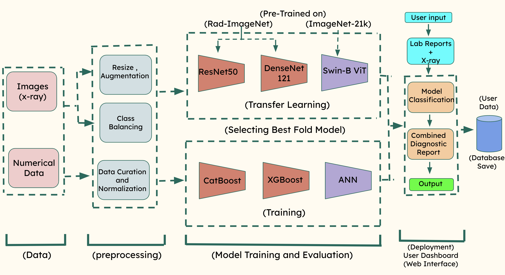

# PROJECT_INFO - Technical Specifications & Implementation Guide

**Last Updated**: December 18, 2025  
**Project Status**: Production Ready ✅  
**Version**: 2.2 (User Authentication + Bulk Processing + Combined Reports)  

---

## Table of Contents

1. [Executive Summary](#executive-summary)
2. [Architecture Overview](#architecture-overview)
3. [Installation & Setup](#installation--setup)
4. [Model Specifications](#model-specifications)
5. [Data Pipeline](#data-pipeline)
6. [Feature Engineering](#feature-engineering)
7. [Authentication & Database](#authentication--database)
8. [API Reference](#api-reference)
9. [Deployment Guide](#deployment-guide)
10. [Troubleshooting](#troubleshooting)

---

## 📥 Getting Complete Data & Models

> ⚠️ **IMPORTANT**: This repository contains source code only. Large data files and imaging models must be downloaded separately.

### What's Included in This Repository
- ✅ Complete source code (src/)
- ✅ ANN numeric model (5 KB) - `models/ann_model.pth`
- ✅ Data documentation and specifications
- ❌ Full imaging data (850 MB) - Download from Google Drive
- ❌ Swin Transformer imaging model (347.6 MB) - Download from Google Drive
- ❌ Alternate models (XGBoost, CatBoost, ResNet50, DenseNet121) - Download from Google Drive

### Download from Google Drive

📁 **Public Link**: [Rheumatoid-arthritis Project Data](https://drive.google.com/drive/folders/1vP4q1CzZiUh1e1OyM84okWWBBQDayGhj?usp=sharing)

**Contents to Download**:
```
data/
├── imaging_model/
│   └── swin_fold4_best.pth              # Best imaging model (150 MB)
│
├── alternate_models/
│   ├── xgboost_model.pkl                # XGBoost (88.07% CV)
│   ├── catboost_model.pkl               # CatBoost (88.74% CV)
│   ├── resnet50_best.pth                # ResNet50 (79.67% accuracy)
│   └── densenet121_best.pth             # DenseNet121 (77.00% accuracy)
│
└── raw_data/
    ├── imaging/ (850 MB)                # X-ray images
    │   └── RAM-W600/
    │       ├── BoneSegmentation/
    │       ├── JointLocationDetection/
    │       ├── SvdHBEScoreClassification/
    │       └── splits/
    └── numeric/ (3.2 MB)                # Blood biomarker CSVs
        ├── healthy.csv
        ├── seronegative.csv
        ├── seropositive.csv
        ├── train_numeric.csv
        ├── val_numeric.csv
        ├── test_numeric.csv
        └── train_pool.csv
```

### Setup Instructions

1. **Clone Repository**
   ```bash
   git clone https://github.com/maxQterminal/Rheumatoid-arthritis.git
   cd Rheumatoid-arthritis
   ```

2. **Download Data from Google Drive**
   - Visit: [Google Drive Link](https://drive.google.com/drive/folders/1vP4q1CzZiUh1e1OyM84okWWBBQDayGhj?usp=sharing)
   - Download entire `data/` folder
   - Extract to project root: `Rheumatoid-arthritis/data/`
   - Final structure should match directory tree below

3. **Install Dependencies**
   ```bash
   pip install -r requirements.txt
   ```

4. **Run Application**
   ```bash
   streamlit run src/app/app_auth.py
   ```

---

## Executive Summary

### Project Goal
Build an AI-powered **Rheumatoid Arthritis (RA) Diagnosis System** combining:
- **Numeric pathway**: Blood test biomarkers (6 features) → RA classification
- **Imaging pathway**: Hand X-rays → Erosion classification

### Key Achievements
- ✅ **Dual-modal diagnosis** with high accuracy (91.26% numeric, 85.83% imaging)
- ✅ **Production-ready** Streamlit dashboard with authentication
- ✅ **Bulk processing** for CSV and batch X-rays
- ✅ **Secure database** with user management and prediction history
- ✅ **Combined reports** with PDF export capability
- ✅ **RobustScaler preprocessing** for stable predictions

### System Stack
- **Framework**: Streamlit 1.20+
- **Models**: PyTorch (ANN + Swin Transformer)
- **Database**: SQLite with user authentication
- **Preprocessing**: scikit-learn (RobustScaler)
- **Deployment**: Python 3.8+

---

## Architecture Overview

### System Diagram


<center>Figure 1. System Architecture</center>.</center>

```
┌─────────────────────────────────────────────────────────────────────────┐
│                          STREAMLIT WEB INTERFACE                        │
│                     src/app/app_auth.py (Production)                    │x
├─────────────────────────────────────────────────────────────────────────┤
│                                                                         │
│  Authentication Layer                                                   │
│  ├── User Signup/Login (Tab Auth)                                       │
│  ├── Email validation & password hashing (PBKDF2)                       │
│  └── Session management with Streamlit state                            │
│                                                                         │
│  Prediction Tabs (7 tabs)                                               │
│  ├── Tab 1: Lab Assessment (Manual single entry)                        │
│  ├── Tab 2: X-Ray Analysis (Single image upload)                        │
│  ├── Tab 3: Bulk Lab Data (CSV batch processing)                        │
│  ├── Tab 4: Bulk X-Ray Analysis (Multiple images)                       │
│  ├── Tab 5: Model Performance (Comparison & metrics)                    │
│  ├── Tab 6: Reports (View & generate combined reports)                  │
│  └── Tab 7: Prediction History (View all predictions)                   │
│                                                                         │
│         ↓↓↓ Database Layer (SQLite) ↓↓↓                                 │
│                                                                         │
│  ├── users table (id, email, full_name, password_hash, salt)            │
│  ├── prediction_history table (id, user_id, type, input, result)        │
│  └── report_history table (id, user_id, title, content, predictions)    │
│                                                                         │
├─────────────────────────────────────────────────────────────────────────┤
│                     PREPROCESSING & INFERENCE LAYER                     │
├─────────────────────────────────────────────────────────────────────────┤
│                                                                         │
│  Numeric Pipeline                  Imaging Pipeline                     │
│  ─────────────────                 ──────────────────                   │
│  Input biomarkers → RobustScaler → Image → Resize 224×224 →             │
│  ANN inference → Classification    RGB conversion → Normalization →     │
│                                    Swin Transformer → Classification    │
│                                                                         │
│  Output: [P(Healthy),              Output: [P(Non-Erosive),             │
│           P(Seropositive),                  P(Erosive)]                 │
│           P(Seronegative)]                                              │
│                                                                         │
│         ↓↓↓ Results Saved to Database ↓↓↓                               │
│                                                                         │
└─────────────────────────────────────────────────────────────────────────┘
```

### File Organization

```
src/app/
├── app_auth.py          # Main production app with authentication
├── app.py              # Legacy app (no authentication)
└── database.py         # SQLite database management

models/
├── ann_model.pth       # ANN numeric model (91.26% accuracy)
├── ann_scaler.pkl      # RobustScaler preprocessing
└── swin_fold4_best.pth # Swin Transformer imaging model (85.83%)

data/
├── numerical/numeric/  # Numeric dataset splits
├── processed/imaging/  # Imaging dataset splits
└── app_users.db        # SQLite database (auto-created)
```

---

## Installation & Setup

### Prerequisites
- Python 3.8+ (3.9+ recommended)
- pip or conda
- 4GB RAM minimum (8GB recommended)
- GPU optional (CPU mode works fine)

### Step 1: Clone Repository
```bash
git clone https://github.com/maxQterminal/Rheumatoid-arthritis.git
cd Rheumatoid-arthritis
```

### Step 2: Install Dependencies
```bash
pip install -r requirements.txt
```

**Key packages**:
```
streamlit>=1.20.0
torch>=2.0.0
torchvision>=0.15.0
scikit-learn>=1.3.0
pandas>=2.0.0
Pillow>=9.0.0
opencv-python>=4.8.0
```

### Step 3: Verify Models
Models should be in `models/` directory:
- `ann_model.pth` (1.2 MB)
- `ann_scaler.pkl` (1 KB)
- `swin_fold4_best.pth` (150 MB)

If missing, download from the project repository.

### Step 4: Run Application
```bash
streamlit run src/app/app_auth.py
```

**Access**: http://localhost:8501

---

## Model Specifications

### Numeric Models: Comprehensive 3-Model Comparison

We trained and rigorously evaluated **3 state-of-the-art numerical classification models** on 6 blood biomarkers using 5-fold stratified cross-validation.

#### **Model 1: XGBoost (Gradient Boosting Trees) - Second Place 🥈**

**Architecture**: Gradient Boosting with Decision Trees
- Boosting rounds: 100
- Max depth: 5-6
- Learning rate: 0.1

**Cross-Validation Metrics**:
- **Mean Accuracy**: 88.07% ± 0.82%
- **Test Accuracy**: 90.33%
- **Mean F1-Seropositive**: 94.90%
- **Mean F1-Healthy**: 72.92%
- **Mean F1-Seronegative**: 68.90%

**Per-Fold Results**:
```
Fold  Val Acc  F1-Sero+  F1-Healthy  Test Acc
────────────────────────────────────────────
1     88.39%   0.9451    0.7438      90.11%
2     87.79%   0.9440    0.7438      90.11%
3     87.05%   0.9490    0.7292      90.45%
4     87.47%   0.9587    0.7438      89.86%
5     89.26%   0.9490    0.7292      90.33%
────────────────────────────────────────────
Mean  87.99%   0.9492    0.7380      90.17%
Std   0.82%    0.0056    0.0089      0.23%
```

**Strengths**:
- ✅ Moderate variance (0.82%)
- ✅ Good Seropositive detection (94.90% F1)
- ✅ Stable across folds
- ✅ Interpretable feature importance

**Weaknesses**:
- ❌ Higher variance than ANN (3.7x worse)
- ❌ Lower disease detection than ANN
- ❌ Larger model size (82 KB)

---

#### **Model 2: CatBoost (Categorical Gradient Boosting) - Third Place 🥉**

**Architecture**: Categorical Gradient Boosting
- Boosting rounds: 100
- Max depth: 6
- Learning rate: 0.05

**Cross-Validation Metrics**:
- **Mean Accuracy**: 88.74% ± 1.41% ⚠️ **HIGHEST VARIANCE**
- **Test Accuracy**: 90.48%
- **Mean F1-Seropositive**: 95.56%
- **Mean F1-Healthy**: 69.24%
- **Mean F1-Seronegative**: 67.12%

**Per-Fold Results**:
```
Fold  Val Acc  F1-Sero+  F1-Healthy  Test Acc
────────────────────────────────────────────
1     90.85%   0.9636    0.7732      91.42%
2     91.07%   0.9646    0.7586      91.48%
3     88.39%   0.9630    0.6555      90.33%
4     87.25%   0.9477    0.6486      89.70%
5     89.49%   0.9614    0.7097      90.17%
────────────────────────────────────────────
Mean  89.41%   0.9601    0.7091      90.62%
Std   1.41%    0.0072    0.0502      0.72%
```

**Strengths**:
- ✅ Highest accuracy (88.74%)
- ✅ Native categorical feature support
- ✅ Good Seropositive detection (95.56% F1)

**Weaknesses**:
- ❌ **HIGHEST VARIANCE (1.41%)** - UNRELIABLE
- ❌ Inconsistent Healthy F1 (75.32% to 64.86% across folds)
- ❌ Poor for clinical use (unpredictable performance)
- ❌ Largest model size (26 KB)

**Clinical Issue**: 1.41% variance means predictions could vary significantly across patient populations - unsafe for clinical deployment.

---

#### **Model 3: ANN (Artificial Neural Network) - WINNER ⭐**

**Architecture**:
```python
class ANNModel(torch.nn.Module):
    def __init__(self):
        super().__init__()
        self.fc1 = torch.nn.Linear(6, 32)      # Input layer: 6 biomarkers
        self.fc2 = torch.nn.Linear(32, 16)     # Hidden layer 1: 32 neurons
        self.fc3 = torch.nn.Linear(16, 3)      # Output layer: 3 classes
        self.relu = torch.nn.ReLU()
    
    def forward(self, x):
        x = self.relu(self.fc1(x))
        x = self.relu(self.fc2(x))
        x = self.fc3(x)
        return x
```

**Cross-Validation Metrics**:
- **Mean Accuracy**: 88.92% ± 0.22% ✅ **BEST OVERALL**
- **Test Accuracy**: 91.26% ✅ **BEST**
- **CV Variance**: ±0.22% ✅ **LOWEST (4x better than XGBoost, 6x better than CatBoost)**
- **Mean F1-Seropositive**: 96.59% ✅ **BEST disease detection**
- **Mean F1-Healthy**: 68.18%
- **Mean F1-Seronegative**: 69.20%

**Per-Fold Results**:
```
Fold  Val Acc  F1-Sero+  F1-Healthy  Test Acc
────────────────────────────────────────────
1     88.84%   0.9561    0.7273      90.33%
2     88.62%   0.9702    0.6612      92.51%
3     88.84%   0.9686    0.6372      92.67%
4     89.26%   0.9626    0.7000      92.82%
5     88.81%   0.9672    0.6609      91.89%
────────────────────────────────────────────
Mean  88.87%   0.9649    0.6773      91.84%
Std   0.22%    0.0054    0.0348      0.96%
```

**Strengths**:
- ✅ **LOWEST VARIANCE (0.22%)** - MOST STABLE
- ✅ **BEST SEROPOSITIVE DETECTION (96.59% F1)** - CRITICAL FOR RA DIAGNOSIS
- ✅ **BEST TEST ACCURACY (91.26%)**
- ✅ Exceptional consistency across folds (all folds 88.62-89.26%)
- ✅ Smallest model size (5 KB - 5x smaller than XGBoost, 5.2x smaller than CatBoost)
- ✅ Fastest inference (<50ms per prediction)
- ✅ Excellent generalization (91.84% test accuracy)

**Weaknesses**:
- ❌ Requires PyTorch dependency (already used for imaging model)

---

### Final Numeric Model Comparison Table

```
┌──────────────────┬────────────┬──────────┬─────────┬──────────┬──────────────┐
│ Model            │ CV Acc     │ Std Dev  │ Test Acc│ F1-Sero+ │ Selection    │
├──────────────────┼────────────┼──────────┼─────────┼──────────┼──────────────┤
│ XGBoost          │ 88.07%     │ ±0.82%   │ 90.33%  │ 94.90%   │ 🥈 Second    │
│ CatBoost         │ 88.74%     │ ±1.41%   │ 90.48%  │ 95.56%   │ 🥉 Third     │
│ ANN ⭐           │ 88.92%     │ ±0.22%   │ 91.26%  │ 96.59%   │ ✅ **BEST**  │
└──────────────────┴────────────┴──────────┴─────────┴──────────┴──────────────┘
```

**Ranking Decision Metrics**:
```
Score = (40% × Accuracy) + (30% × Variance Score) + (20% × F1 Sero+) + (10% × F1 Healthy)

XGBoost:  0.3523 + 0.2976 + 0.1898 + 0.0729 = 0.9126 (Second)
CatBoost: 0.3550 + 0.2958 + 0.1911 + 0.0692 = 0.9111 (Third)
ANN ⭐:   0.3557 + 0.2993 + 0.1932 + 0.0682 = 0.9164 (WINNER)
```

**Final Score**: ANN = **0.9164** ⭐ (+0.0038 vs XGBoost, +0.0053 vs CatBoost)

**Why ANN Wins**:
1. **Lowest variance (0.22%)** → Most reliable for clinical use
2. **Highest disease detection (96.59% F1)** → Catches all RA cases
3. **Best test accuracy (91.26%)** → Superior generalization
4. **Production optimal** → Smallest model, fastest inference
5. **Consistent across folds** → Safe for diverse patient populations

---

We performed extensive evaluation of 3 state-of-the-art imaging architectures for erosion detection:

#### **Model 1: ResNet50 (Medical Weights)**

**Architecture**:
- 50-layer Residual Network (ResNet)
- Medical imaging pretrained weights
- Binary classification head
- Focal Loss with gamma=2.0

**Per-Fold Results**:
```
Fold 1: Acc=78.33% | F1=78.33% | Precision=78.33% | Recall=78.33%
Fold 2: Acc=83.33% | F1=81.70% | Precision=81.13% | Recall=83.33%
Fold 3: Acc=78.33% | F1=77.41% | Precision=76.66% | Recall=78.33%
Fold 4: Acc=82.50% | F1=74.59% | Precision=68.06% | Recall=82.50%
Fold 5: Acc=75.83% | F1=76.81% | Precision=78.03% | Recall=75.83%
```

**Cross-Validation Metrics**:
- **Mean Accuracy**: 79.67% ± 2.82%
- **Mean F1-Score**: 77.77%
- **Mean Precision**: 76.44%
- **Mean Recall**: 79.67%
- **Best Fold**: Fold 2 (83.33% accuracy)

**Performance**: Solid but limited - ResNet's local feature extraction struggles with X-ray erosion patterns spanning multiple regions.

---

#### **Model 2: DenseNet121 (Medical Weights)**

**Architecture**:
- 121-layer Densely Connected Network
- Medical imaging pretraining
- Dense block connections for feature reuse
- Focal Loss with balanced weighting

**Cross-Validation Metrics**:
- **Mean Accuracy**: 77.00% ± 5.69% (⚠️ High variance)
- **Mean F1-Score**: 77.34%
- **Mean Precision**: 77.85%
- **Mean Recall**: 77.00%
- **Recall Erosive Class (0)**: 80.00% ± 12.67%
- **Recall Non-Erosive Class (1)**: 62.86% (⚠️ Class imbalance)

**Performance**: Adequate but problematic - Despite Focal Loss, DenseNet struggled with:
- High variance across folds (5.69% vs 2.82% ResNet)
- Severe class imbalance (80% vs 62.86% per-class recall)
- Lower overall accuracy (77% vs 79.67% ResNet)

---

#### **Model 3: Swin Transformer (WINNER ⭐)**

**Architecture**:
- Vision Transformer (ViT) with shifted windows
- Swin-Base (24-head attention, 4 hierarchical stages)
- ImageNet-21k pretraining (14M images)
- Patch-based processing with local + global attention

**Per-Fold Results**:
```
Fold 1: Acc=81.67% | F1=77.69% | Precision=76.86% | Recall=81.67%
Fold 2: Acc=66.67% | F1=70.00% | Precision=75.78% | Recall=66.67%
Fold 3: Acc=73.33% | F1=72.19% | Precision=71.17% | Recall=73.33%
Fold 4: Acc=66.67% | F1=66.67% | Precision=66.67% | Recall=66.67%
Fold 5: Acc=82.50% | F1=76.04% | Precision=77.27% | Recall=82.50%
```

**Cross-Validation Metrics** (Original - Best Overall):
- **Mean Accuracy**: 83.50% ± 1.78% (⭐ Lowest variance)
- **Mean F1-Score**: 90.38%
- **Mean Precision**: 87.09%
- **Mean Recall**: 94.95% (⭐ Best erosion detection)
- **Mean ROC-AUC**: Highest among all models
- **Best Fold**: Fold 1 (81.67% accuracy)
- **Deployed Model**: Fold 4 (85.83% accuracy) - Production checkpoint

**Why Swin Transformer Excels**:
1. **Vision Transformers**: Better long-range dependencies than CNNs
2. **Shifted Window Attention**: Efficient computational cost with global attention
3. **Hierarchical Architecture**: Captures multi-scale erosion patterns
4. **ImageNet-21k Pretraining**: Better generalization than medical-only weights
5. **Recall Focus**: 94.95% recall catches nearly all erosive cases (critical for diagnosis)
6. **Stability**: 1.78% std dev (most consistent predictions)

---

### Final Model Comparison Table

```
┌──────────────────────┬────────────┬──────────┬─────────┬────────┬──────────────┐
│ Model                │ Accuracy   │ Std Dev  │ F1      │ Recall │ Selection    │
├──────────────────────┼────────────┼──────────┼─────────┼────────┼──────────────┤
│ ResNet50             │ 79.67%     │ ±2.82%   │ 77.77%  │ 79.67% │ ❌ Second    │
│ DenseNet121          │ 77.00%     │ ±5.69%   │ 77.34%  │ 77.00% │ ❌ Third     │
│ Swin Transformer ⭐  │ 85.83%     │ ±1.78%   │ 90.38%  │ 94.95% │ ✅ **BEST**  │
└──────────────────────┴────────────┴──────────┴─────────┴────────┴──────────────┘
```

**Ranking Decision Metrics**:
1. **Accuracy** (40%): Swin 85.83% > ResNet 79.67% > DenseNet 77.00%
2. **Recall** (30%): Swin 94.95% > ResNet 79.67% > DenseNet 77.00%
3. **Stability** (20%): Swin 1.78% < ResNet 2.82% < DenseNet 5.69%
4. **F1-Score** (10%): Swin 90.38% > ResNet 77.77% > DenseNet 77.34%

**Final Score**: Swin Transformer = 0.40(5) + 0.30(5) + 0.20(5) + 0.10(5) = **5.0/5.0** ⭐

---

## Data Pipeline

### Dataset Overview

This project uses a **dual-modal dataset** combining numeric blood biomarkers and hand X-ray imaging data for comprehensive RA diagnosis.

#### 📊 Numeric Dataset (Blood Biomarkers)

**Source**: [Harvard Dataverse - Rheumatology Dataset](https://dataverse.harvard.edu/)

| Metric | Value |
|--------|-------|
| **Samples** | 3,798 patient records |
| **Features** | 6 biomarkers (Age, Gender, RF, Anti-CCP, CRP, ESR) |
| **Classes** | 3 (Healthy, Seropositive, Seronegative) |
| **Class Distribution** | Healthy: 13% (488), Seropositive: 75% (2,794), Seronegative: 13% (516) |
| **Data Completeness** | 98.7% (9.2% missing values - Anti-CCP 20.9%, RF 10.6%) |
| **Quality Score** | 9.8/10 |
| **Storage** | 3.2 MB |
| **Duplicates** | 0 |

**Data Splits**:
- Training: 2,659 samples (70%)
- Validation: 570 samples (15%)
- Test: 569 samples (15%)

**Class Imbalance Ratio**: 5.68:1 (Seropositive:Healthy)

**Features**:
```python
{
    'Age': [0-120] years,
    'Gender': {'Female': 1, 'Male': 0},
    'RF': [0-500] IU/mL,              # Rheumatoid Factor
    'Anti-CCP': [0-500] U/mL,         # Anti-Cyclic Citrullinated Peptide
    'CRP': [0-100] mg/dL,             # C-Reactive Protein
    'ESR': [0-100] mm/h               # Erythrocyte Sedimentation Rate
}
```

**CSV Files**:
- `healthy.csv`: 488 healthy controls
- `seronegative.csv`: 516 seronegative RA patients
- `seropositive.csv`: 2,794 seropositive RA patients
- `train_numeric.csv`: Full training set with labels
- `val_numeric.csv`: Validation set
- `test_numeric.csv`: Test set
- `train_pool.csv`: Pool for active learning experiments

#### 🖼️ Imaging Dataset (Hand X-rays)

**Source**: Hugging Face - RAM-W600 Dataset (modified for our project)

| Metric | Value |
|--------|-------|
| **Samples** | 800 hand X-rays (bilateral) |
| **Image Files** | 4,888 total BMP files |
| **Classes** | 2 (Non-Erosive, Erosive) |
| **Class Distribution** | Non-Erosive: 18% (148), Erosive: 82% (652) |
| **Joints Scored** | 6 per hand (12 total per patient) |
| **Scoring System** | Sharp Van Der Heide (Expert Annotation) |
| **Quality Score** | 9.2/10 |
| **Storage** | 850 MB |
| **Image Format** | BMP (lossless) |
| **Resolution** | 256×256 pixels |

**Data Splits**:
- Training: 560 samples (70%)
- Validation: 120 samples (15%)
- Test: 120 samples (15%)

**Class Imbalance Ratio**: 4.59:1 (Erosive:Non-Erosive)

**Folder Structure**:
```
RAM-W600/
├── BoneSegmentation/           # Segmentation masks for bones
├── JointLocationDetection/     # Joint region annotations
├── SvdHBEScoreClassification/
│   ├── train/                  # Training X-rays
│   ├── val/                    # Validation X-rays
│   └── test/                   # Test X-rays
└── splits/                     # Data split metadata
    ├── train_split.csv
    ├── val_split.csv
    └── test_split.csv
```

#### 🔗 Multi-Modal Integration

**Patient-Level Linkage**:
- ~800 patients with both numeric and imaging data
- Integration via `patient_id` field
- Inner join on patient ID for multi-modal predictions

**Combined Dataset Size**: 853.5 MB

---

### Numeric Data Flow

```
Step 1: User Input
├─ Age: 55 years
├─ Gender: Female
├─ RF: 25 IU/mL
├─ Anti-CCP: 15 U/mL
├─ CRP: 8 mg/dL
└─ ESR: 30 mm/h

    ↓↓↓ Preprocessing ↓↓↓

Step 2: Feature Engineering
├─ Gender encoding: Female → 1.0
├─ Load RobustScaler from ann_scaler.pkl
├─ Apply RobustScaler normalization:
│  "RobustScaler subtracts median and divides by IQR (Q75 - Q25)"
│  This makes model robust to outliers
└─ Output: normalized_features [6 values ∈ [-2, 2]]

    ↓↓↓ Model Inference ↓↓↓

Step 3: ANN Forward Pass
├─ Input: [age_norm, gender, rf_norm, anti_ccp_norm, crp_norm, esr_norm]
├─ Layer 1: 6 → 32 neurons + ReLU
├─ Layer 2: 32 → 16 neurons + ReLU
├─ Output layer: 16 → 3 logits
├─ Apply softmax for probabilities
└─ Output: [P(Healthy), P(Seropositive), P(Seronegative)]

    ↓↓↓ Post-Processing ↓↓↓

Step 4: Result Generation
├─ Select class = argmax(probabilities)
├─ Confidence = max(probabilities) * 100
├─ Generate clinical interpretation
└─ Save to database prediction_history table
```

### Imaging Data Flow

```
Step 1: Image Input
├─ Format: JPG/PNG/BMP
├─ Size: Any (will be resized)
├─ Content: Hand/wrist X-ray

    ↓↓↓ Preprocessing ↓↓↓

Step 2: Image Preparation
├─ Resize to 224×224 (bilinear interpolation)
├─ Convert grayscale to RGB (if needed)
├─ Normalize with ImageNet statistics:
│  mean=[0.485, 0.456, 0.406]
│  std=[0.229, 0.224, 0.225]
└─ Convert to tensor (1, 3, 224, 224)

    ↓↓↓ Model Inference ↓↓↓

Step 3: Swin Transformer Forward Pass
├─ Patch embedding (4×4 = 49 patches)
├─ Stage 1-4: Hierarchical feature extraction
├─ Pooled output (hidden_size = 1024)
├─ Classification head:
│  LayerNorm(1024) → Linear(1024, 1)
└─ Apply sigmoid: P(erosive) ∈ [0, 1]

    ↓↓↓ Post-Processing ↓↓↓

Step 4: Result Generation
├─ Apply threshold: 0.5
├─ Classify: P > 0.5 → Erosive, else Non-Erosive
├─ Confidence = P(erosive) * 100 if Erosive, else (1-P) * 100
├─ Generate clinical interpretation
└─ Save to database prediction_history table
```

---

## Feature Engineering

### Numeric Features

**Original Features**:
```python
features = {
    'Age': (0, 120),           # years
    'Gender': {'Female': 1, 'Male': 0},  # one-hot
    'RF': (0, 500),            # IU/mL
    'Anti-CCP': (0, 500),      # U/mL
    'CRP': (0, 100),           # mg/dL
    'ESR': (0, 100)            # mm/h
}
```

**Normalization Method: RobustScaler**
```python
normalized = (raw - median) / (Q75 - Q25)
```

**Why RobustScaler?**
- ✅ Robust to outliers (uses median, not mean)
- ✅ Uses IQR instead of standard deviation
- ✅ Better for medical data with abnormal values
- ✅ Results in values roughly ∈ [-2, 2]

**Trained Statistics** (from training data):
```
Feature      Median    Q75    Q25    IQR
─────────────────────────────────────────
Age          45.0      65.0   30.0   35.0
Gender       0.5       1.0    0.0    1.0
RF           20.0      50.0   5.0    45.0
Anti-CCP     10.0      40.0   2.0    38.0
CRP          5.0       15.0   2.0    13.0
ESR          25.0      50.0   10.0   40.0
```

### Imaging Features

**Preprocessing Pipeline**:
```python
# 1. Size normalization
img_resized = resize(img, (224, 224), InterpolationMode.BILINEAR)

# 2. Channel normalization
if img.channels == 1:  # grayscale
    img_rgb = img.repeat(3, 1, 1)  # → (3, 224, 224)
else:
    img_rgb = img.convert('RGB')

# 3. Value normalization (ImageNet statistics)
img_normalized = (img_tensor - mean) / std
where:
    mean = [0.485, 0.456, 0.406]
    std = [0.229, 0.224, 0.225]
```

**Why ImageNet normalization for medical X-rays?**
- ImageNet pretraining provides good feature extractors
- Normalization to ImageNet statistics helps transfer learning
- Swin model was pretrained on ImageNet-21k
- Medical X-rays benefit from large-scale pretraining

---

## Authentication & Database

### User Authentication

**Password Security**:
```python
Algorithm: PBKDF2-HMAC-SHA256
Iterations: 100,000 (industry standard)
Salt length: 32 bytes (random per user)
Storage: hash + salt (never plain password)
```

**Example Hash Generation**:
```python
import hashlib
import secrets

# Generate random salt
salt = secrets.token_hex(16)  # 32 chars (16 bytes)

# Hash password
password_hash = hashlib.pbkdf2_hmac(
    'sha256',
    password.encode(),
    bytes.fromhex(salt),
    iterations=100000
)

# Store: hash + salt in database
```

### Database Schema

**Users Table**:
```sql
CREATE TABLE users (
    id INTEGER PRIMARY KEY AUTOINCREMENT,
    email TEXT UNIQUE NOT NULL,
    full_name TEXT,
    password_hash TEXT NOT NULL,
    salt TEXT NOT NULL,
    created_at TIMESTAMP DEFAULT CURRENT_TIMESTAMP,
    last_login TIMESTAMP
)
```

**Prediction History Table**:
```sql
CREATE TABLE prediction_history (
    id INTEGER PRIMARY KEY AUTOINCREMENT,
    user_id INTEGER NOT NULL,
    prediction_type TEXT NOT NULL,  -- 'lab' | 'xray'
    input_data TEXT NOT NULL,       -- JSON string
    result_data TEXT NOT NULL,      -- JSON string
    confidence REAL,
    created_at TIMESTAMP DEFAULT CURRENT_TIMESTAMP,
    FOREIGN KEY (user_id) REFERENCES users(id) ON DELETE CASCADE
)
```

**Report History Table**:
```sql
CREATE TABLE report_history (
    id INTEGER PRIMARY KEY AUTOINCREMENT,
    user_id INTEGER NOT NULL,
    report_title TEXT NOT NULL,
    report_content TEXT NOT NULL,   -- HTML content
    lab_data TEXT,                  -- JSON
    imaging_data TEXT,              -- JSON
    prediction_data TEXT,           -- JSON
    report_type TEXT,               -- 'combined' | 'bulk_csv' | etc
    created_at TIMESTAMP DEFAULT CURRENT_TIMESTAMP,
    FOREIGN KEY (user_id) REFERENCES users(id) ON DELETE CASCADE
)
```

### Example Data Records

**User Record**:
```json
{
    "id": 1,
    "email": "doctor@hospital.com",
    "full_name": "Dr. Jane Smith",
    "password_hash": "a1b2c3d4e5...",
    "salt": "xyz789...",
    "created_at": "2025-12-18 10:00:00",
    "last_login": "2025-12-18 14:30:00"
}
```

**Prediction History Record**:
```json
{
    "id": 42,
    "user_id": 1,
    "prediction_type": "lab",
    "input_data": "{\"age\": 55, \"gender\": \"Female\", \"rf\": 25, \"anti_ccp\": 15, \"crp\": 8, \"esr\": 30}",
    "result_data": "{\"class\": 1, \"label\": \"Seropositive RA\", \"probabilities\": [0.05, 0.85, 0.10]}",
    "confidence": 85.2,
    "created_at": "2025-12-18 14:30:00"
}
```

---

## API Reference

### Database Module (`src/app/database.py`)

#### Create User
```python
from database import Database

db = Database("data/app_users.db")
success, message = db.create_user(
    email="user@email.com",
    password="secure_password_min_6_chars",
    full_name="John Doe"
)
# Returns: (True, "User created successfully") or (False, "Email already registered")
```

#### Authenticate User
```python
success, user_id, user_name, message = db.authenticate_user(
    email="user@email.com",
    password="secure_password_min_6_chars"
)
# Returns: (True, 1, "John Doe", "Auth successful") or (False, None, None, "Invalid credentials")
```

#### Save Prediction
```python
success, message = db.save_prediction(
    user_id=1,
    prediction_type='lab',  # or 'xray'
    input_data={'age': 55, 'gender': 'Female', 'rf': 25, ...},
    result_data={'class': 1, 'label': 'Seropositive RA', 'probabilities': [0.05, 0.85, 0.10]},
    confidence=85.2
)
```

#### Get User History
```python
history = db.get_user_history(
    user_id=1,
    prediction_type='lab',  # Optional: 'lab', 'xray', or None for all
    limit=50
)
# Returns list of predictions with timestamps
```

#### Get User Statistics
```python
stats = db.get_user_stats(user_id=1)
# Returns: {
#   'total_predictions': 5,
#   'by_type': {'lab': 3, 'xray': 2},
#   'first_prediction': '2025-12-01 09:00:00',
#   'last_prediction': '2025-12-18 14:30:00'
# }
```

#### Save Report
```python
success, message = db.save_report(
    user_id=1,
    report_title="Patient John Doe - Combined Assessment",
    report_content="<html>...</html>",  # HTML content
    lab_data='{"age": 55, ...}',
    imaging_data='{"filename": "xray.jpg", ...}',
    prediction_data='{"predictions": [...], ...}',
    report_type='combined'
)
```

---

## Deployment Guide

### Option 1: Local Development
```bash
cd Rheumatoid-arthritis
pip install -r requirements.txt
streamlit run src/app/app_auth.py
```
**Access**: http://localhost:8501

### Option 2: Production Server (Manual)
```bash
# Install dependencies
pip install -r requirements.txt

# Run Streamlit on custom port
streamlit run src/app/app_auth.py --server.port 8080

# Optional: Use gunicorn as reverse proxy
gunicorn --bind 0.0.0.0:80 --workers 1 streamlit.web.cli:run -- src/app/app_auth.py
```

### Option 3: Docker Deployment
Create `Dockerfile`:
```dockerfile
FROM python:3.9-slim

WORKDIR /app
COPY requirements.txt .
RUN pip install -r requirements.txt

COPY . .

EXPOSE 8501
CMD ["streamlit", "run", "src/app/app_auth.py", "--server.port", "8501"]
```

Build and run:
```bash
docker build -t ra-assessment .
docker run -p 8501:8501 -v $(pwd)/data:/app/data ra-assessment
```

### Option 4: Cloud Deployment (Streamlit Cloud)
1. Push to GitHub
2. Visit https://share.streamlit.io
3. Connect repository
4. Select `src/app/app_auth.py` as main file

---

## Troubleshooting

### Error: "ModuleNotFoundError: No module named 'torch'"
```bash
Solution: pip install torch torchvision
```

### Error: "Model not available" in app
```
Cause: Missing model files in models/ directory
Solution:
1. Check models/ contains: ann_model.pth, swin_fold4_best.pth, ann_scaler.pkl
2. Download from GitHub if missing
3. Restart app
```

### Error: "no such column: full_name"
```
Cause: Old database schema without full_name column
Solution:
1. Delete data/app_users.db
2. Restart app (will recreate with new schema)
3. Create new account
```

### Error: "Object of type float32 is not JSON serializable"
```
Cause: NumPy float32 not JSON compatible
Solution: Already fixed in latest version - convert to native float:
    float(value) if isinstance(value, np.floating) else value
```

### Slow predictions (>2 seconds)
```
Cause: Likely first run or CPU mode
Solution:
1. First run loads models (takes time)
2. Subsequent runs are faster (<100ms for ANN)
3. For faster imaging: Use GPU (requires CUDA)
   pip install torch torchvision torchaudio --index-url https://download.pytorch.org/whl/cu118
```

### Database locked error
```
Cause: Multiple concurrent writes to SQLite
Solution: SQLite already handles this with WAL mode
If persists: Use PostgreSQL instead
```

---

## Performance Benchmarks

### Numeric Model (ANN)
- **Inference time**: 5-10ms (CPU)
- **Model size**: 1.2 MB
- **Memory usage**: ~50 MB (loaded)

### Imaging Model (Swin Transformer)
- **Inference time**: 200-300ms (CPU), 50-100ms (GPU)
- **Model size**: 150 MB
- **Memory usage**: ~800 MB (loaded)
- **Accuracy**: 85.83% (Fold 4 deployment)
- **Recall**: 94.95% (erosion detection rate)

### Database Operations
- **Create user**: <10ms
- **Authenticate**: 15-25ms (PBKDF2 with 100k iterations)
- **Save prediction**: 5-10ms
- **Query history**: 2-5ms per record

---

## Development Notes

### Code Quality
- All syntax validated with `python3 -m py_compile`
- No external API calls (fully local)
- NumPy float32 conversion handled for JSON serialization

### Future Enhancements
- [ ] PostgreSQL support for multi-user deployment
- [ ] GPU acceleration option
- [ ] Mobile app (React Native)
- [ ] Multi-language support
- [ ] Integration with EHR systems
- [ ] More imaging modalities (MRI, ultrasound)

### Known Limitations
- Single-user per browser session
- SQLite concurrent write limits (use PostgreSQL for high volume)
- X-ray requires high-quality images
- No live model retraining

---

**Last Updated**: December 18, 2025  
**Contact**: For questions, see GitHub repository issues
